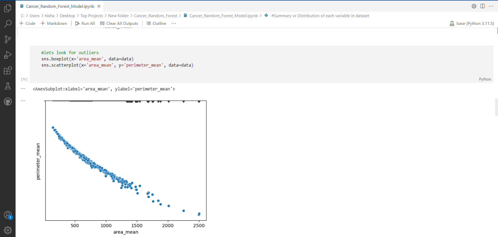
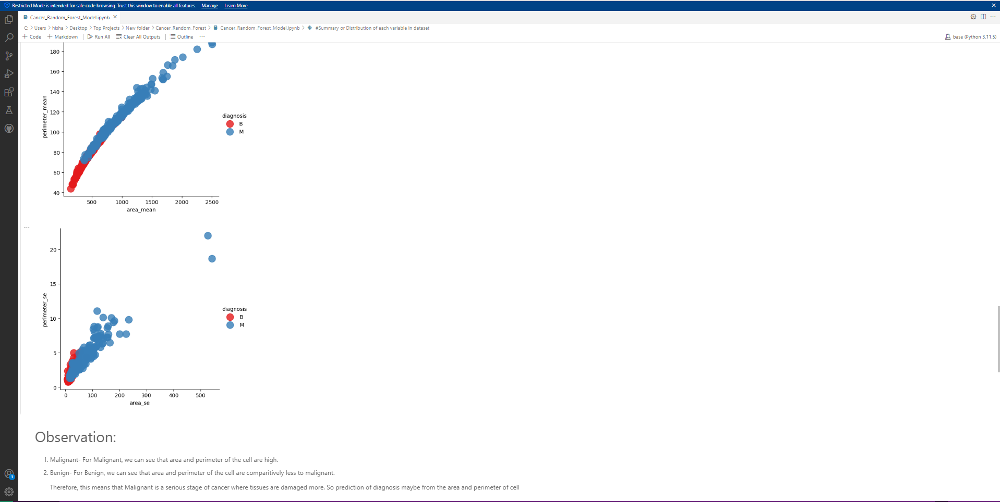

# Cancer Diagnosis Prediction Using Machine Learning

This project focuses on predicting the diagnosis of breast cancer (Malignant or Benign) using various machine learning models. The models are evaluated and tuned to find the best performing one, helping to identify cancerous cells based on different cell properties.

## Table of Contents

1. [Introduction](#introduction)
2. [Dataset](#dataset)
3. [Libraries Used](#libraries-used)
4. [Data Exploration](#data-exploration)
5. [Data Cleaning](#data-cleaning)
6. [Data Visualization](#data-visualization)
7. [Model Selection and Evaluation](#model-selection-and-evaluation)
8. [Hyperparameter Tuning](#hyperparameter-tuning)
9. [Final Model Evaluation](#final-model-evaluation)
10. [How to Run](#how-to-run)
11. [References](#references)

## Introduction

Breast cancer is one of the most common types of cancer affecting women worldwide. Early detection and diagnosis are critical for effective treatment. This project aims to build a predictive model using machine learning techniques to classify breast cancer tumors as either Malignant (cancerous) or Benign (non-cancerous) based on features derived from cell nuclei present in breast mass images.

## Dataset

The dataset used in this project contains measurements from digitized images of fine needle aspirate (FNA) of breast masses. Each record includes features such as radius, texture, smoothness, and others that describe the characteristics of the cell nuclei.

- **Total number of samples**: Varies (depending on the dataset provided)
- **Features**: Includes `radius_mean`, `texture_mean`, `perimeter_mean`, `area_mean`, etc.
- **Target variable**: `diagnosis` (M = Malignant, B = Benign)

## Libraries Used

- `pandas`: For data manipulation and analysis.
- `numpy`: For numerical operations.
- `matplotlib`: For plotting graphs.
- `seaborn`: For data visualization.
- `scikit-learn`: For implementing machine learning models and evaluation.

## Data Exploration

1. **Data Loading**: Loaded the dataset using `pandas`.
2. **Basic Statistics**: Used methods like `shape`, `head()`, and `info()` to get a quick overview of the dataset.
3. **Missing Values**: Checked for missing values using `isnull().sum()`.

```python
# Checking for missing values
data.isnull().sum()
```

## Data Cleaning

1. **ID Column Removal**: Dropped the `id` column as it does not contribute to the diagnosis prediction.
2. **Target Variable Conversion**: Converted the `diagnosis` column into numeric values (1 for Malignant, 0 for Benign).

```python
# Convert diagnosis column to numeric
y = pd.Series(np.where(y.values == 'M', 1, 0), y.index)
```

## Data Visualization

Visualizing the data helps understand the distribution and relationships between features:

1. **Boxplots**: Used to identify outliers and the distribution of variables like `radius_mean` and `area_mean`.
2. **Scatter Plots**: Examined the relationship between `area_mean` and `perimeter_mean` for different diagnosis categories.


3. **Heatmap**: Showed the correlation between features.

```python
# Correlation heatmap
sns.heatmap(data.corr(), annot=True)
```

### Observations:

1. **Malignant Tumors**: Tend to have higher values for `area_mean` and `perimeter_mean`.
2. **Benign Tumors**: Have relatively lower values for these features, indicating less aggressive tumor characteristics.


## Model Selection and Evaluation

We evaluated multiple models to find the best one for this classification task:

1. **Models Evaluated**: Decision Tree, Random Forest, K-Nearest Neighbors (KNN).
2. **Cross-Validation**: Used 5-fold cross-validation to evaluate each model's performance.

```python
# Evaluate models using cross-validation
models = {
    'Decision Tree': DecisionTreeClassifier(),
    'Random Forest': RandomForestClassifier(),
    'K-Nearest Neighbors': KNeighborsClassifier()
}

for name, model in models.items():
    scores = cross_val_score(model, X, y, cv=5)
    print(f'{name}: {np.mean(scores):.4f} ({np.std(scores):.4f})')
```

## Hyperparameter Tuning

Used Grid Search to optimize the hyperparameters of the Random Forest model, which showed promising performance:

1. **Parameter Grid**: Defined a grid of possible values for `n_estimators`, `max_depth`, `min_samples_split`, and `min_samples_leaf`.
2. **Grid Search**: Conducted grid search with 5-fold cross-validation to find the best parameter combination.

```python
# Grid search for best hyperparameters
param_grid = {
    'n_estimators': [100, 200, 300],
    'max_depth': [5, 10, None],
    'min_samples_split': [2, 5, 10],
    'min_samples_leaf': [1, 2, 4]
}

grid = GridSearchCV(RandomForestClassifier(), param_grid, cv=5)
grid.fit(X, y)
```

## Final Model Evaluation

After finding the best hyperparameters, the final Random Forest model was evaluated on the testing set:

1. **Train-Test Split**: Split the data into training and testing sets using `train_test_split()`.
2. **Model Training**: Trained the Random Forest model with the best hyperparameters.
3. **Accuracy Calculation**: Measured the accuracy of predictions on the testing set.

```python
# Test accuracy
accuracy = accuracy_score(y_test, y_pred)
print(f'Test accuracy: {accuracy:.4f}')
```

## How to Run

1. Clone the repository:

    ```bash
    git clone https://github.com/yourusername/cancer-diagnosis-prediction.git
    ```

2. Install the required Python libraries:

    ```bash
    pip install pandas numpy seaborn matplotlib scikit-learn
    ```

3. Run the Jupyter Notebook:

    ```bash
    jupyter notebook
    ```

4. Open the `Cancer_Diagnosis_Prediction.ipynb` file and execute the cells.

## References

- Scikit-Learn Documentation: [Decision Tree Classifier](https://scikit-learn.org/stable/modules/generated/sklearn.tree.DecisionTreeClassifier.html), [Random Forest Classifier](https://scikit-learn.org/stable/modules/generated/sklearn.ensemble.RandomForestClassifier.html)
- Breast Cancer Wisconsin (Diagnostic) Dataset

---

This README provides an overview of the cancer diagnosis prediction project using various machine learning models. For detailed implementation, visualizations, and insights, refer to the project notebook.
